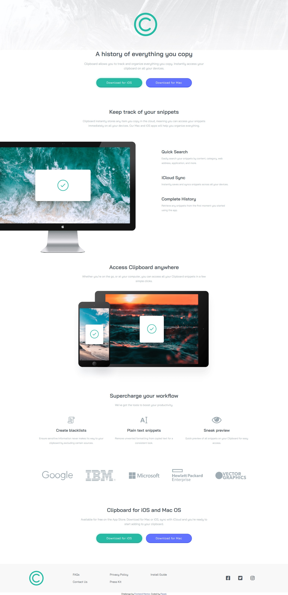

# Frontend Mentor - Clipboard landing page solution

This is a solution to the [Clipboard landing page challenge on Frontend Mentor](https://www.frontendmentor.io/challenges/clipboard-landing-page-5cc9bccd6c4c91111378ecb9). Frontend Mentor challenges help you improve your coding skills by building realistic projects. 

## Table of contents

- [Overview](#overview)
  - [Screenshot](#screenshot)
  - [Links](#links)
- [My process](#my-process)
  - [Built with](#built-with)
  - [What I learned](#what-i-learned)
  - [Useful resources](#useful-resources)
- [Author](#author)

## Overview

### Screenshot

### Links

- Live Site URL: [Frontend Mentor clipboard landing page](https://mp-projects.github.io/Clipboard-landing-page/)

## My process

### Built with

- Semantic HTML5 markup
- BEM
- SCSS
- Flexbox
- Mobile-first workflow

### What I learned

I have learnt using BEM and SCSS. It was first time I was using it.

### Useful resources

- [Flexbox](https://css-tricks.com/snippets/css/a-guide-to-flexbox/) - This helped me with using flexbox. On this site is cheat sheet you need to work with flexbox.

## Author

- Frontend Mentor - [Paweł](https://www.frontendmentor.io/profile/yourusername)

